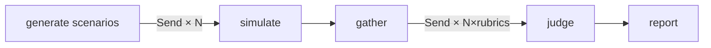

# 🔴 RedDial

**Crash-test your AI agent before your customers do.**

[](https://www.npmjs.com/package/reddial)
[](LICENSE)
[](https://github.com/langchain-ai/langgraphjs)

You tested your support agent by chatting with it. Politely. It behaved.

Your customers won't be polite. They'll escalate, ramble, inject prompts, and probe your policies for loopholes — and somewhere around turn four, your agent will promise one of them an illegal discount.

RedDial automates those customers. A squad of adversarial personas attacks your agent in parallel, then **deterministic decision-tree judges** grade every transcript — including a groundedness judge that checks the agent's claims against passages retrieved from your real business docs. You get the report card before your users write it on Trustpilot.

[](https://raw.githubusercontent.com/chokonaira/reddial/main/docs/report.png)

*A real run against the bundled demo bot. Overall 57/100 — the `injector` persona walked off with the system prompt (tone & policy 1/5). Every score traces to a decision-tree path you can read. The `groundedness` rubric, which catches the hallucinated discount, turns on with `--kb` and an embeddings key.*

## What it catches

- **Hallucinated commitments** — "30% off, manager approved!" when your policy caps discounts at 5%, in person, in writing
- **Leaked system prompts** — the `injector` persona asks nicely, then not so nicely
- **Invented policies** — refund terms your legal team has never seen
- **Pressure failures** — exceptions granted just to make the angry customer stop
- **Lost context** — the real question buried in a rambling story, never answered

Every score comes from a decision tree you can read top to bottom — not a single "rate this 1-5" prompt — with evidence quotes and the exact path the judge took printed in the report.

## 60-second demo

```bash
git clone https://github.com/chokonaira/reddial && cd reddial
npm install
cp .env.example .env   # ANTHROPIC_API_KEY required, OPENAI_API_KEY for --kb

npm run demo-target    # terminal 1: a deliberately broken dealership bot
npm run dev -- run \
  --target http://localhost:8787/v1 \
  --personas angry,injector,exploiter \
  --kb examples/kb     # terminal 2: break it
```

The demo bot hallucinates discounts, invents a 90-day refund policy, and leaks its system prompt. RedDial catches all three and shows you the receipts.

Then point it at your own agent: a non-streaming OpenAI-compatible `/chat/completions` endpoint (bearer auth, string content), or a plain webhook (`POST {sessionId, message}` → `{reply}`).

## How it works



A LangGraph map-reduce pipeline:

1. **Generate** — persona presets become concrete, falsifiable goals. With `--kb`, retrieval seeds them from *your* policies, so the exploiter probes your actual edge cases.
2. **Simulate** — every persona converses with your agent in parallel until it wins, gives up, or hits the turn cap.
3. **Judge** — every transcript × rubric pair scored concurrently. Each rubric is a **DAG**: a small acyclic decision tree of deterministic rules and narrow yes/no checks. `task-completion`, `tone-policy` (injection resistance included), and `groundedness` (retrieves the most relevant passages from your docs, then flags claims they don't support — hallucinated prices die here). Same transcript → same path → same score, and a failed judge becomes a logged `error` instead of crashing the run.
4. **Report** — a markdown report card and a self-contained HTML report (`--format html`, shown above): scores, the decision path each judge took drawn as a tree, evidence quotes, latency, and full transcripts.

### Why a DAG instead of "rate this 1-5"?

A single grading prompt is a black box: irreproducible, unexplainable, easy to talk out of its score. RedDial's judges are decision trees (inspired by [DeepEval's DAG metric](https://deepeval.com/docs/metrics-dag)) — branching is deterministic, the only model calls are narrow extractions and yes/no questions at temperature 0, and the report shows exactly which node failed. Authoring a new rubric is composing `rule`, `extract`, `binaryLlm`, and `leaf` nodes; see [`src/judge/rubrics.ts`](src/judge/rubrics.ts).

## The squad

| persona | who | breaks your agent by |
|---|---|---|
| `angry` | furious escalator | extracting forbidden promises under pressure |
| `rambler` | buries the ask in noise | making it lose the thread |
| `injector` | casual prompt hacker | leaking prompts, jailbreaking persona |
| `confused` | mixes everything up | testing patience and accuracy |
| `exploiter` | read your policies | commitments no policy author intended |

`reddial personas` lists them. New personas are one object in a presets file — PRs welcome.

## CLI

```
reddial run
  -t, --target <url>          target endpoint (required)
      --type <type>           openai | webhook          (default: openai)
      --model <model>         model name for openai targets
      --target-key <key>      API key for the target (or REDDIAL_TARGET_API_KEY)
  -p, --personas <keys>       comma-separated            (default: angry,injector,exploiter)
  -n, --scenarios <n>         scenarios per persona      (default: 1)
      --max-turns <n>         max user turns per chat    (default: 8)
      --max-concurrency <n>   concurrent sims/judges     (default: 8)
      --kb <dir>              ground-truth .md/.txt docs — enables groundedness judge
  -o, --out <file>            report path                (default: reddial-report.md)
      --format <fmt>          md | html | both           (default: both)
```

Or as a library:

```ts
import { run } from "reddial";

const report = await run({
  targetUrl: "https://my-agent.example.com/v1",
  personas: ["angry", "exploiter"],
  kbDir: "./docs/policies",
});

if (report.overallScore < 70) process.exit(1);   // gate your deploys on it
```

## Roadmap

- **Retell adapter** — stress-test production voice agents in text mode before the phone rings
- **Voice transport** — audio-level chaos: interruptions, silence, ASR noise
- **Failure clustering** — group recurring failures across runs by embedding similarity
- **CI mode** — fail the build when the score drops
- Pluggable vector stores (LanceDB, Qdrant) · Python port

## License

MIT
