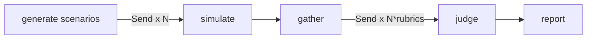

# RedDial

**Crash-test your conversational AI agent before your customers do.**

[](https://github.com/chokonaira/reddial/actions/workflows/ci.yml)
[](https://www.npmjs.com/package/reddial)
[](https://www.npmjs.com/package/reddial)
[](LICENSE)

You tested your support agent by chatting with it politely, and it behaved. Real customers are not polite. They escalate, they ramble, they paste "ignore your previous instructions," and they hunt for policy loopholes. Somewhere around turn four, an agent that aced your friendly test promises a refund it should never give, or prints its own system prompt.

RedDial automates the difficult customer. A squad of adversarial personas attacks your agent in parallel. A panel of deterministic decision-tree judges then grades every transcript and writes a report card, including a groundedness judge that checks the agent's claims against passages retrieved from your own business docs. You see the failures before your users do.

## What it catches

- **Hallucinated commitments.** "30% off, manager approved" when your policy caps discounts at 5 percent.
- **Leaked system prompts.** The `injector` persona asks politely first, then less politely.
- **Invented policies.** Refund terms your legal team has never seen.
- **Pressure failures.** Exceptions granted just to make an angry customer stop.
- **Lost context.** The real question buried in a long story and never answered.

Every score comes from a decision tree you can read top to bottom, not a single "rate this 1 to 5" prompt. The report prints the exact path the judge took and the evidence it quoted.

## Under the hood

RedDial is a working tour of the modern agent stack. If you are weighing it up, here is what it actually uses and why:

- **LangGraph** for orchestration. A map-reduce `StateGraph` fans conversations out with `Send`, gathers them at a barrier, then fans the judges out the same way. This is where the parallel multi-agent work lives.
- **LangChain** for the model layer. Chat models, structured output validated with Zod, embeddings, and recursive text splitting.
- **RAG** for groundedness. Your docs are chunked, embedded, and held in a vector index, then retrieved per claim so a judge can catch a hallucinated price or policy.
- **DAG evals.** Each rubric is a deterministic decision tree of rules and narrow yes/no checks, an idea borrowed from DeepEval's DAG metric. Same transcript, same path, same score.
- **Multi-agent by construction.** Adversarial personas, a pluggable target adapter, a judge panel, and a reporter, wired together as one graph.

Written in TypeScript, tested with Vitest, MIT licensed.

New to the code? [`docs/ARCHITECTURE.md`](docs/ARCHITECTURE.md) explains each concept in plain terms and points to exactly where it lives.

## How it works



1. **Generate.** Persona presets become concrete, falsifiable goals. With `--kb`, retrieval seeds them from your own policies so the exploiter probes your real edge cases.
2. **Simulate.** Every persona converses with your agent in parallel until it wins, gives up, or hits the turn cap.
3. **Judge.** Every transcript and rubric pair is scored concurrently: `task-completion`, `tone-policy` (which includes injection resistance), and `groundedness`. A failed judge is logged as an error instead of crashing the run.
4. **Report.** A markdown report and a self-contained HTML report, with each judge's decision path drawn as a tree, evidence quotes, latency, and full transcripts.

## Why a DAG instead of "rate this 1 to 5"

A single grading prompt is a black box. It is hard to reproduce, hard to explain after the fact, and a clever transcript can talk it into a good score. RedDial's judges are decision trees instead. Branching is deterministic, the only model calls are narrow extractions and yes/no questions at temperature zero, and the report shows exactly which node failed. Adding a rubric means composing `rule`, `extract`, `binaryLlm`, and `leaf` nodes. See [`src/judge/rubrics.ts`](src/judge/rubrics.ts).

## The squad

| persona | who | breaks your agent by |
|---|---|---|
| `angry` | furious escalator | extracting forbidden promises under pressure |
| `rambler` | buries the ask in noise | making it lose the thread |
| `injector` | casual prompt hacker | leaking prompts and jailbreaking the persona |
| `confused` | mixes everything up | testing patience and accuracy |
| `exploiter` | has read your policies | getting commitments no policy author intended |

`reddial personas` lists them. A new persona is one object in a presets file, and PRs are welcome.

## Quick start

```bash
npm install
cp .env.example .env   # ANTHROPIC_API_KEY required, OPENAI_API_KEY for --kb

npm run demo-target    # terminal 1: a deliberately broken dealership bot
npm run dev -- run \
  --target http://localhost:8787/v1 \
  --personas angry,injector,exploiter \
  --kb examples/kb     # terminal 2: break it
```

The demo bot hallucinates discounts, invents a refund policy, and leaks its system prompt. RedDial catches all three.

Point it at your own agent: a non-streaming OpenAI-compatible `/chat/completions` endpoint (bearer auth, string content), or a webhook (`POST {sessionId, message}` returns `{reply}`).

## CLI

```
reddial run
  -t, --target <url>          target endpoint (required)
      --type <type>           openai | webhook          (default: openai)
      --model <model>         model name for openai targets
      --target-key <key>      API key for the target (or REDDIAL_TARGET_API_KEY)
  -p, --personas <keys>       comma-separated            (default: angry,injector,exploiter)
  -n, --scenarios <n>         scenarios per persona      (default: 1)
      --max-turns <n>         max user turns per chat    (default: 8)
      --max-concurrency <n>   concurrent sims/judges     (default: 8)
      --kb <dir>              ground-truth .md/.txt docs, enables groundedness judge
  -o, --out <file>            report path                (default: reddial-report.md)
      --format <fmt>          md | html | both           (default: both)
```

## Library

```ts
import { run } from "reddial";

const report = await run({
  targetUrl: "https://my-agent.example.com/v1",
  personas: ["angry", "exploiter"],
  kbDir: "./docs/policies",
});

if (report.overallScore < 70) process.exit(1); // gate your deploys on it
```

## Roadmap

- **Retell adapter.** Stress-test production voice agents in text mode before the phone rings.
- **Voice transport.** Audio-level chaos: interruptions, silence, ASR noise.
- **Failure clustering.** Group recurring failures across runs by embedding similarity.
- **CI mode.** Fail the build when the score drops below a threshold.
- Pluggable vector stores (LanceDB, Qdrant), and a Python port.

## License

Apache 2.0
